# Kotlin Grid

An API for generating grids of cells.

## Tilings

### Square

```kotlin
val grid: Grid = SquareGridGenerator.generate(height = 5, width = 5)
```


### Triangular

#### Standard

```kotlin
val grid: Grid = TriangleGridGenerator.generate(width = 7, height = 4)
```

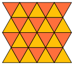

#### Offset

```kotlin
val grid: Grid = TriangleGridGenerator.generate(width = 7, height = 4, option = TriangleGridOption.OFFSET)
```

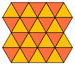

#### Spiky

```kotlin
val grid: Grid = TriangleGridGenerator.generate(width = 7, height = 4, option = TriangleGridOption.SPIKY)
```

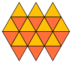

#### Offset Spiky

```kotlin
val grid: Grid = TriangleGridGenerator.generate(width = 7, height = 4, option = TriangleGridOption.OFFSET_SPIKY)
```

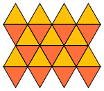

#### Triangle

```kotlin
val grid: Grid = TriangleGridGenerator.generate(4, 5, TriangleGridOption.TRIANGLE)
```


### Hexagonal

#### Standard

```kotlin
val grid: Grid = HexGridGenerator.generate(width = 5, height = 5)
```


#### Standard Skip Last

```kotlin
val grid: Grid = HexGridGenerator.generate(width = 5, height = 5, option = HexGridOption.STANDARD_SKIP_LAST)
```

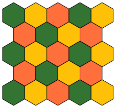

#### Offset

```kotlin
val grid: Grid = HexGridGenerator.generate(width = 5, height = 5, option = HexGridOption.OFFSET)
```

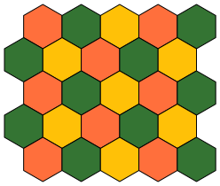

#### Offset Skip Last

```kotlin
val grid: Grid = HexGridGenerator.generate(width = 5, height = 5, option = HexGridOption.OFFSET_SKIP_LAST)
```

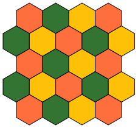

#### Triangular

```kotlin
val grid: Grid = HexGridGenerator.generate(width = 5, height = 5, option = HexGridOption.TRIANGLE)
```

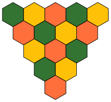

### Octagonal/Square (Truncated Square)

#### Start with octagon

```kotlin
val grid: Grid =
SquareOctagon2GridGenerator.generate(width = 5, height = 5, option = SquareOctagon2GridOption.START_OCTAGON)
```


#### Start with square

```kotlin
val grid: Grid =
SquareOctagon2GridGenerator.generate(width = 5, height = 5, option = SquareOctagon2GridOption.START_SQUARE)
```


### Tri Hexagonal

#### Start with hexagon

```kotlin
val grid: Grid =
TriHexagonalGridGenerator.generate(width = 7, height = 5, option = SquareOctagon2GridOption.START_HEXAGON)
```

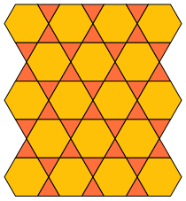

#### Start with triangles

```kotlin
val grid: Grid =
TriHexagonalGridGenerator.generate(width = 7, height = 5, option = SquareOctagon2GridOption.START_TRIANGLES)
```


### Elongated Triangular

#### Start with full row of triangles

```kotlin
val grid: Grid = ElongatedTriangularGridGenerator.generate(12, 9, ElongatedTriangularGridOption.START_TRIANGLES_FULL)
```


#### Start with row of triangles - spiky

```kotlin
val grid: Grid = ElongatedTriangularGridGenerator.generate(12, 9, ElongatedTriangularGridOption.START_TRIANGLES_SPIKY)
```

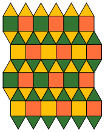

#### Start with row of squares

```kotlin
val grid: Grid = ElongatedTriangularGridGenerator.generate(12, 9, ElongatedTriangularGridOption.START_TRIANGLES_FULL)
```

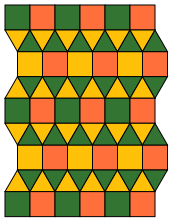

#### Start with row of squares - spiky finish

```kotlin
val grid: Grid = ElongatedTriangularGridGenerator.generate(12, 8, ElongatedTriangularGridOption.START_TRIANGLES_SPIKY)
```


### Rhombi Tri Hexagonal

These grids are generated in overlapping repetitions of the singleton pattern.

#### Singleton

```kotlin
val grid: Grid = RhombiTriHexagonalGridGenerator.generate(width = 1, height = 1)
```


#### Standard

```kotlin
val grid: Grid = RhombiTriHexagonalGridGenerator.generate(width = 3, height = 3)
```


#### Standard Skip Last

Skip last is disabled when width is 1.

```kotlin
val grid: Grid =
RhombiTriHexagonalGridGenerator.generate(width = 3, height = 3, RhombiTriHexagonalGridOption.STANDARD_SKIP_LAST)
```


#### Offset

```kotlin
val grid: Grid = RhombiTriHexagonalGridGenerator.generate(width = 3, height = 3, RhombiTriHexagonalGridOption.OFFSET)
```

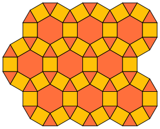

#### Offset Skip Last

Skip last is disabled when width is 1.

```kotlin
val grid: Grid =
RhombiTriHexagonalGridGenerator.generate(width = 3, height = 3, RhombiTriHexagonalGridOption.OFFSET_SKIP_LAST)
```


#### Triangular

```kotlin
val grid: Grid =
RhombiTriHexagonalGridGenerator.generate(width = 3, height = 3, RhombiTriHexagonalGridOption.TRIANGLE)
```


### Snub Hexagonal

These grids are generated in overlapping repetitions of the singleton pattern.

#### Singleton

```kotlin
val grid: Grid = SnubHexagonalGridGenerator.generate(width = 1, height = 1)
```

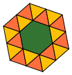

#### Standard

```kotlin
val grid: Grid = SnubHexagonalGridGenerator.generate(width = 3, height = 3)
```

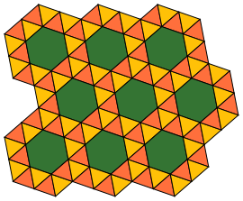

#### Standard Skip Last

Skip last is disabled when width is 1.

```kotlin
val grid: Grid =
SnubHexagonalGridGenerator.generate(width = 3, height = 3, SnubHexagonalGridOption.STANDARD_SKIP_LAST)
```


#### Offset

```kotlin
val grid: Grid = SnubHexagonalGridGenerator.generate(width = 3, height = 3, SnubHexagonalGridOption.OFFSET)
```

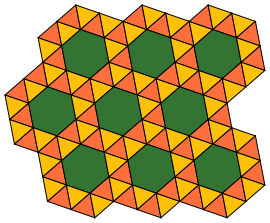

#### Offset Skip Last

Skip last is disabled when width is 1.

```kotlin
val grid: Grid = SnubHexagonalGridGenerator.generate(width = 3, height = 3, SnubHexagonalGridOption.OFFSET_SKIP_LAST)
```


#### Triangular

```kotlin
val grid: Grid = SnubHexagonalGridGenerator.generate(width = 3, height = 3, SnubHexagonalGridOption.TRIANGLE)
```

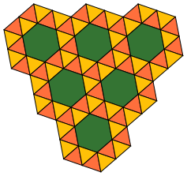

### Planned

#### Floret Pentagonal


## SVG Grid Generation

Generates images like those used in the supported section of this README file.

### Example

```kotlin
  val svg: String = SquareGridGenerator.generate(height = 5, width = 5).toSvg()
```